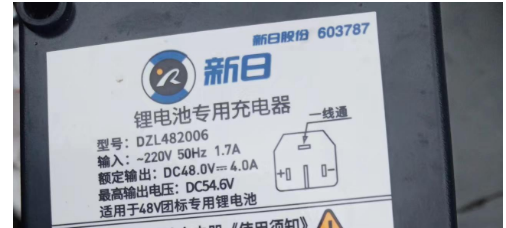

程序电流限制:	0.25A(10s) - 4A(1s)

1、用电器 功率过低，通电10s后被结束订单

​	

2、用电器 功率过大，通电2s后被结束订单

3、充电过程中，部分跑灯不跑

​	可能性：可能是电流过小，订单被结束了；或者程序bug，不显示。

解决方法，

​	修改程序： 

(1)电流阀值 0.15A(10s) - 4A(3s)

(2)电路中零线与 隔离地进行连接，形成回路，导致检测IC采样不准。

**解决办法，走树状线，禁止回路形成。**

